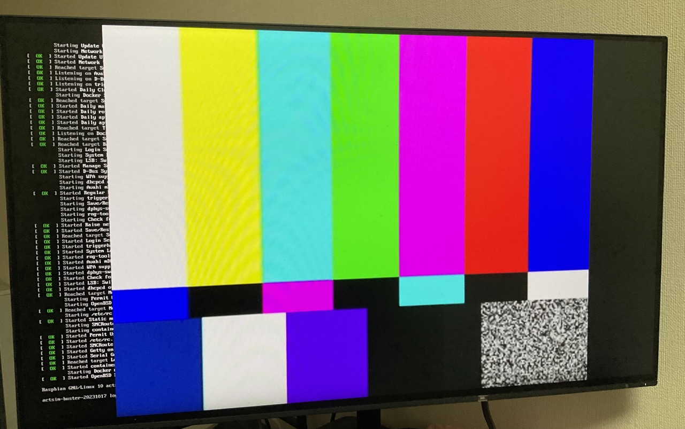

# RTSP Player

**※このサンプルアプリケーションはActcastOS 4 に対応しています**

## 概要

RTSP を用いてリモートの映像を再生するサンプルアプリです。

- RTSP の映像をキャプチャするために [actfw-gstreamer](https://pypi.org/project/actfw-gstreamer/) を利用しています。
- GStreamer を用いて RTSP サーバーに直接接続し、映像ストリームを取得します。

## 前提

- 対象機種: ディスプレイ接続済み Raspberry Pi (3 以上)
- RTSP で映像を配信できるサーバー (ネットワークカメラなど)
  - [PC からテスト映像を配信する方法](#pc-からテスト映像を配信する方法)に記載の手順により、PC から映像を配信することもできます。
- [actdk](https://actcast.io/docs/ja/ForVendor/ApplicationDevelopment/GettingStarted/ActDK/)
- [Docker](https://www.docker.com/)

## Actsim での動作確認

### 準備

actdk に[確認用 Raspberry Pi を登録](https://actcast.io/docs/ja/ForVendor/ApplicationDevelopment/GettingStarted/TestInLocalDevice/#%e7%a2%ba%e8%aa%8d%e7%94%a8-raspberry-pi-%e3%81%ae%e7%99%bb%e9%8c%b2)します。

```bash
actdk remote add <IDENTIFIER_YOU_LIKE>@<REMOTE>
```

`act_settings.json` を編集し、ネットワークカメラなどの RTSP URL を指定します。

### actdk run

`actdk run` により Actsim 上でアプリケーションの動作確認をすることができます。停止させるには `Ctrl + C` を押します。

```bash
actdk run -a <IDENTIFIER_YOU_LIKE>
```

`[{"fps": 4.998874520340274}]` といったログが出力されます。また、Raspberry Pi にディスプレイを接続している場合はディスプレイに映像が表示されます。

以下はテスト映像を再生したときの様子です。



## Actcast Agent での動作確認

まず[Actcast に新規アプリケーションを作成](https://actcast.io/docs/ja/ForVendor/ApplicationDevelopment/GettingStarted/CreateProject/)します。

`.actdk/setting.json` の `app_server_id` を、先程作成したアプリケーションの ID に変更します。

[アプリケーションをアップロードし、実機にインストール](https://actcast.io/docs/ja/ForVendor/ApplicationDevelopment/GettingStarted/TestViaActcast/)します。

### 設定項目

- `display`: ディスプレイに表示するかどうかを指定します。
- `rtsp_url`: RTSP の URL を指定します。
- `fps`: RTSP で映像を再生する際のフレームレートを指定します。

## PC からテスト映像を配信する方法

このディレクトリ上で `docker compose up` することにより、PC から `rtsp://{YOUR_LOCAL_IP}:8554/test` でテスト映像を配信することができます。

デバイスが PC と同じネットワーク上にある場合はこの RTSP URL を設定値の `rtsp_url` に指定することで、PC から配信される映像を再生することができます。なお、firewall などでポート 8554 がブロックされている場合は、ポートを開放する必要があります。

`YOUR_LOCAL_IP` は PC のローカル IP アドレスになります (Docker コンテナの IP アドレスではありません)。OS によって確認方法が異なります。

<details>
<summary>Windows (WSL2)</summary>

1. WSL2 上で `docker compose up` して rtsp 配信を開始しておく
2. PowerShell で 以下を実行して Windows の IP アドレスを拾う

```shell
$ ipconfig
:
:
Wireless LAN adapter Wi-Fi:
   接続固有の DNS サフィックス . . . . .:
   リンクローカル IPv6 アドレス. . . . .: fe80::d4ea:db39:34eb:71a5%7
   IPv4 アドレス . . . . . . . . . . . .: 192.168.11.5
   サブネット マスク . . . . . . . . . .: 255.255.255.0
   デフォルト ゲートウェイ . . . . . . .: 192.168.11.1
```

3. Windows の IP アドレスを RTSP URL に指定する

`rtsp_url` は Windows の IP アドレスを指定します。
以下は `act_settings.json` の例です。

```json
{
  "display": true,
  "rtsp_url": "rtsp://192.168.11.5:8554/test",
  "fps": 5
}
```

ここで指定する IP アドレスは WSL2 の IP アドレスではなく、Windows の IP アドレスであることに注意してください。

4. PowerShell を 管理者権限で実行して以下のスクリプトを実行する

以下は firewall の設定、および Windows への通信を WSL2 に中継するための設定になります。

```powershell
# 出典: https://qiita.com/k_tomo/items/82234030e712c44c2e40

# 現在のユーザーが管理者権限を持っていない場合に、スクリプトを管理者権限で再実行するための処理です。
if (!([Security.Principal.WindowsPrincipal][Security.Principal.WindowsIdentity]::GetCurrent()).IsInRole("Administrators")) { Start-Process powershell.exe "-File `"$PSCommandPath`"" -Verb RunAs; exit }

# WSL 2 インスタンスの IP アドレスを取得します。
# bash.exe を使って、ip r コマンドを実行し、結果から IP アドレスを抽出します。
# IP アドレスが取得できない場合、スクリプトは終了します。
# IP アドレスのうち 'XXX.XXX.XXX.1' を除く
$ip = bash.exe -c "ip addr show | grep -oP '(?<=inet\s)\d+\.\d+\.\d+\.\d+' | grep -v '\.1$'"
if( ! $ip ){
echo "The Script Exited, the ip address of WSL 2 cannot be found";
exit;
}

# 通信を許可するポート番号のリストを指定します。
# このスクリプトでは、8554, 554 の 2 つのポートを指定しています。
$ports=@(8554,554);
$ports_a = $ports -join ",";

# 以前に作成されたファイアウォールの例外ルールを削除します。
iex "Remove-NetFireWallRule -DisplayName 'WSL 2 Firewall Unlock' ";

# New-NetFireWallRule コマンドを使用して、指定したポート番号に対するインバウンドおよびアウトバウンドのファイアウォール例外ルールを作成します。
iex "New-NetFireWallRule -DisplayName 'WSL 2 Firewall Unlock' -Direction Outbound -LocalPort $ports_a -Action Allow -Protocol TCP";
iex "New-NetFireWallRule -DisplayName 'WSL 2 Firewall Unlock' -Direction Inbound -LocalPort $ports_a -Action Allow -Protocol TCP";

# netsh interface portproxy コマンドを使用して、ポートプロキシの設定を行います。
# 指定したポート番号に対して、IP アドレスを介しての接続を許可します。
for( $i = 0; $i -lt $ports.length; $i++ ){
  $port = $ports[$i];
iex "netsh interface portproxy add v4tov4 listenport=$port listenaddress=* connectport=$port connectaddress=$ip";
}

# 作成されたポートプロキシの設定を表示します。
iex "netsh interface portproxy show v4tov4";
```

最後に以下のようなログが出力されれば設定完了です。

```shell
ipv4 をリッスンする:         ipv4 に接続する:

Address         Port        Address         Port
--------------- ----------  --------------- ----------
*               8554        172.20.86.32    8554
*               554         172.20.86.32    554
```

</details>

<details>
<summary>Linux</summary>

以下のコマンドでローカル IP アドレスを確認することができます。

```shell
ip addr show | grep -oP '(?<=inet\s)\d+\.\d+\.\d+\.\d+' | grep -v '\.1$'
```

</details>

<details>
<summary>macOS</summary>

以下の手順でローカル IP アドレスを確認することができます。

1. 「システム環境設定」を開く
1. 「ネットワーク」を選択
1. 「Wi-Fi」(あるいは確認したいネットワーク接続名) を選択
1. 「詳細...」ボタンを押下
1. 「TCP/IP」を選択
1. 「IPv4 アドレス」欄を確認
</details>
